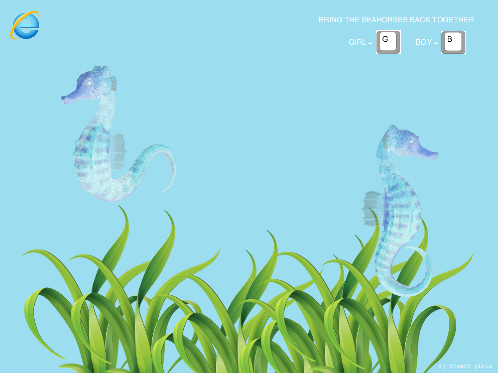
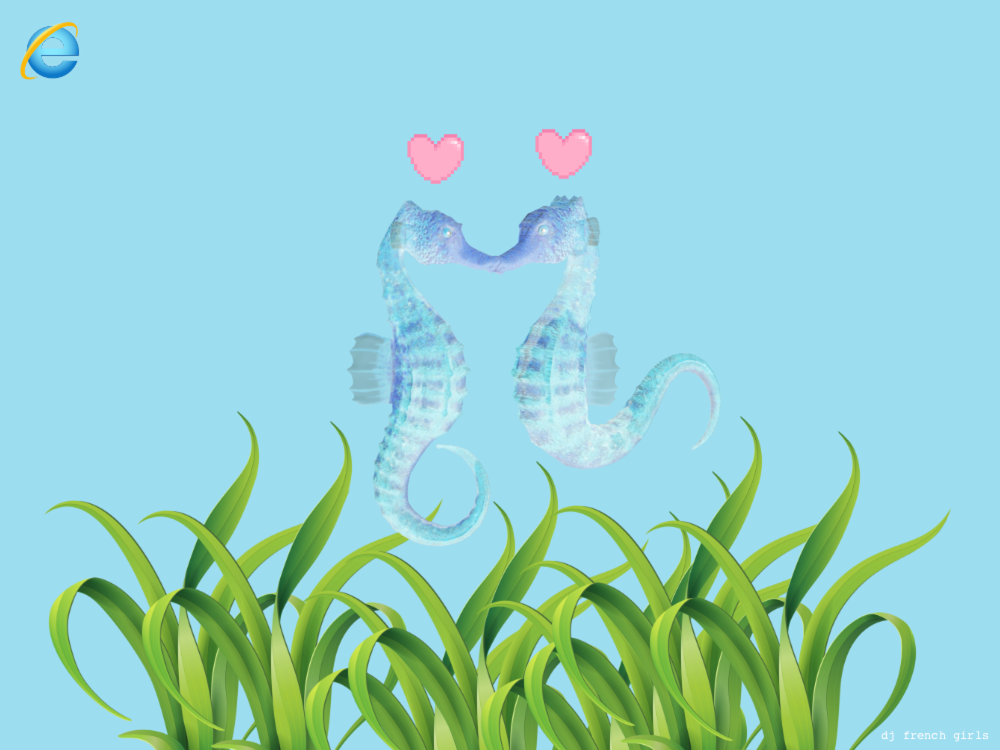

# Seahorse-Love
This game is about helping two in-love seahorses to find each other in a loop of sea plants on the bottom of the sea.

You do this by dragging each of them with the mouse while pressing either G for seahorse *girl* or B for seahorse *boy* on your keyboard. In order to do that, you need to guess which one is the girl and which one is the boy. When you click the Internet Explorer icon, the seahorses will again be apart and you can start over trying to make their noses touch.

Just like the sea plants are looped, the switching between being together and not being together can be looped. Seahorse-Love is one big loop.

The game is inspired by the seapunk aesthetic which was a popular internet aesthetic in the beginning of the 2010’s.

